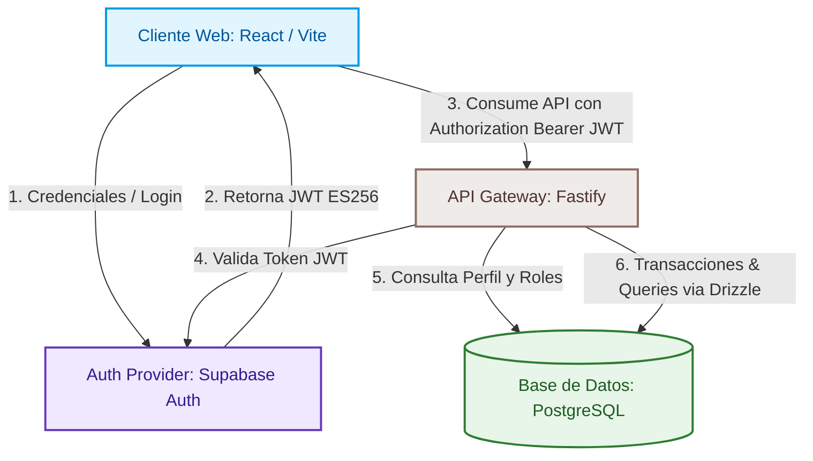
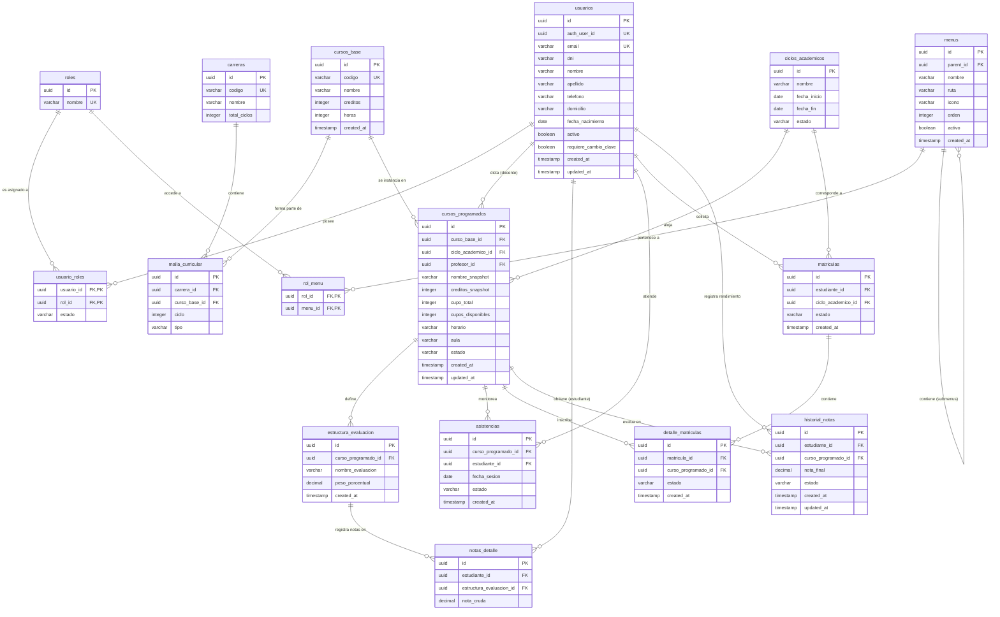

# Documentación Técnica Oficial: Arquitectura del Sistema SICAC

Este documento describe de forma exhaustiva la arquitectura, el diseño de la base de datos, el flujo de seguridad y la estructura general del **Sistema Integral de Control Académico (SICAC)**. Está diseñado para servir como guía definitiva tanto para ingenieros backend orientados a sistemas transaccionales como para desarrolladores frontend de la aplicación.

---

## 1. Resumen Ejecutivo y Visión del Sistema

### ¿Qué es SICAC?
El **Sistema Integral de Control Académico (SICAC)** es una plataforma de software diseñada para automatizar y gestionar los procesos académicos del Club de Arte y Cultura. Esto incluye la gestión de perfiles de usuario (administradores, gestores, docentes y estudiantes), la administración del catálogo de asignaturas, la programación académica por ciclos, el proceso de matrícula con control de concurrencia y la gestión del rendimiento académico (evaluaciones, asistencias y calificaciones finales).

### Propósito General
Proveer una solución robusta, de alta disponibilidad y con estrictas garantías de consistencia transaccional. El sistema minimiza la sobreventa de cupos en matrículas simultáneas, preserva la integridad de los datos históricos de cursos y centraliza la autenticación mediante un esquema desacoplado y seguro de Identidad Federada.

### Stack Tecnológico Principal

```
+--------------------------------------------------------------------+
|                         STACK TECNOLÓGICO                          |
+----------------------+----------------------+----------------------+
|       FRONTEND       |       BACKEND        |    BASE DE DATOS     |
+----------------------+----------------------+----------------------+
| • React 18 & Vite    | • Fastify (Node.js)  | • PostgreSQL         |
| • TailwindCSS        | • Drizzle ORM        | • Supabase Auth      |
| • Shadcn UI          | • Fastify JWT        | • Migraciones SQL    |
| • TanStack Query     | • Swagger / OpenAPI  |                      |
+----------------------+----------------------+----------------------+
```

*   **Frontend (React/Vite)**: Desarrollado con una arquitectura moderna de componentes reactivos apoyada en **TailwindCSS** y **Shadcn UI** para el diseño visual. La sincronización y caché del estado del servidor se delega a **TanStack Query** (React Query), optimizando el consumo de red.
*   **Backend (Fastify/Drizzle)**: Construido sobre **Fastify**, un microframework de Node.js diseñado para ofrecer máximo rendimiento con mínimo overhead. El acceso y modelado de datos se gestiona mediante **Drizzle ORM**, un ORM TypeScript-first de tipo *SQL-first* que provee consultas relacionales declarativas de alto desempeño sin perder el control sobre las queries SQL generadas.
*   **Base de Datos y Proveedor de Autenticación**: Base de datos **PostgreSQL** relacional que aloja las tablas de negocio, combinada con **Supabase Auth** como proveedor de identidad administrado para la gestión de credenciales, seguridad de tokens (JWT), recuperación de contraseñas y registro seguro.

---

## 2. Arquitectura Global del Sistema

El sistema utiliza una arquitectura cliente-servidor desacoplada, donde el frontend interactúa con el backend mediante una API RESTful autodocumentada, y la autenticación se delega a un flujo OAuth2/OIDC implícito gestionado por Supabase Auth.

### Diagrama de Arquitectura de Alto Nivel



### Flujo de Petición Típico (Request Lifecycle)

1.  **Autenticación**: El usuario introduce sus credenciales en el cliente React. El SDK cliente de Supabase envía estas credenciales a **Supabase Auth**, que valida el inicio de sesión y retorna un token JWT firmado con el algoritmo asimétrico ES256.
2.  **Envío de Petición**: El cliente React añade el JWT en la cabecera HTTP `Authorization: Bearer <TOKEN>` de todas las solicitudes enviadas al backend.
3.  **Intercepción y Validación del Token**: El plugin de seguridad del backend (`auth.plugin.ts`) extrae el token y lo valida mediante la API de administración de Supabase (`app.supabase.auth.getUser(token)`). Esto previene inconsistencias por rotación de claves públicas.
4.  **Enriquecimiento del Contexto**: El backend toma el ID único del usuario de autenticación (`auth_user_id`), busca su registro en la tabla de base de datos local `usuarios` y extrae sus roles asignados. Esta información se inyecta en el objeto `request.user`.
5.  **Autorización (RBAC)**: Un middleware de ruta comprueba que el rol asignado en `request.user` tenga los privilegios necesarios. Si no los tiene, aborta la petición con un código `403 Forbidden`.
6.  **Ejecución de Lógica y Transacción**: Se ejecuta el controlador correspondiente, abriendo transacciones SQL atómicas contra la base de datos PostgreSQL mediante **Drizzle ORM**.
7.  **Respuesta**: Se retorna un payload JSON estructurado al cliente React, el cual actualiza el estado local y la interfaz de usuario.

---

## 3. Modelo de Base de Datos v2

El modelo de datos está diseñado bajo principios de normalización relacional y aislamiento transaccional estricto, mitigando conflictos de concurrencia e inconsistencias en datos históricos.

### Diagrama Entidad-Relación (ERD)



### Pilares del Diseño de la Base de Datos

#### A. Modelo de Identidad Centralizada y Desacoplada
El sistema evita registrar hashes de contraseñas, tokens de refresco y logs de sesiones directamente en la base de datos transaccional local. Toda la infraestructura de login y encriptación se externaliza a **Supabase Auth**. 
La conexión con nuestra base de datos local se realiza mediante el campo `auth_user_id` de la tabla `usuarios`, el cual referencia al identificador único generado por Supabase. Esto permite desacoplar la lógica de perfiles, datos de contacto e historial académico de las complejidades de ciberseguridad asociadas al control de credenciales.

#### B. Patrón Catálogo/Instancia para Cursos
Para asegurar que los cambios curriculares del presente no destruyan la veracidad del historial académico del pasado, se implementa el patrón **Catálogo/Instancia**:
*   **Catálogo (`cursos_base`)**: Almacena la definición del curso de forma estática (código, nombre general, horas académicas y créditos estándar).
*   **Instancia (`cursos_programados`)**: Representa la apertura de ese curso en un ciclo y horario específicos. Al crearse, realiza un **snapshot de los atributos del catálogo** (`nombre_snapshot`, `creditos_snapshot`). El estudiante se matricula en esta instancia. Si el plan de estudios general del catálogo es modificado posteriormente, el historial de créditos y nombres cursados en periodos anteriores no se altera, manteniendo la validez del récord histórico estudiantil.

#### C. Ledger de Auditoría Transaccional e Integridad de Cupos
1.  **Prevención de Overselling (Sobreventa de Cupos)**: En periodos de matrícula de alta concurrencia, múltiples transacciones intentan reservar cupo en un curso simultáneamente. Para evitar sobrepasar la capacidad física, el backend ejecuta una transacción atómica donde la reducción de cupo se condiciona a nivel de motor de base de datos utilizando el siguiente criterio:
    ```sql
    UPDATE cursos_programados 
    SET cupos_disponibles = cupos_disponibles - 1 
    WHERE id = :cursoProgramadoId 
      AND cupos_disponibles > 0 
      AND ciclo_academico_id = :cicloId;
    ```
    Si el número de filas afectadas por esta sentencia es cero, se asume que los cupos se agotaron en el instante de la transacción. El sistema lanza una excepción inmediata, abortando e invalidando la creación del detalle de matrícula (`detalle_matriculas`).
2.  **Consistencia de Notas (`historial_notas`)**: La tabla actúa como un récord consolidado final del rendimiento estudiantil en un curso. Se calcula mediante una transacción que procesa las evaluaciones individuales (`notas_detalle`), pondera los porcentajes oficiales de `estructura_evaluacion` y ejecuta un upsert seguro en el historial:
    ```typescript
    await tx.insert(historialNotas)
        .values({ estudianteId, cursoProgramadoId, notaFinal, estado })
        .onConflictDoUpdate({
            target: [historialNotas.estudianteId, historialNotas.cursoProgramadoId],
            set: { notaFinal, estado }
        });
    ```

---

## 4. Backend (Fastify API)

El backend de SICAC está optimizado para ofrecer tiempos de respuesta en el orden de milisegundos, aislando las responsabilidades en módulos independientes y altamente tipados.

### Estructura de Carpetas

```
src/
├── db/                  # Configuración de base de datos e inicialización del ORM
│   ├── index.ts         # Cliente Drizzle & Pool de conexión a PostgreSQL
│   └── schema.ts        # Definición del esquema de datos relacional y sus relaciones
├── plugins/             # Extensiones globales de Fastify
│   ├── auth.plugin.ts   # Middleware de JWT, Supabase SDK e inyección de contexto
│   ├── db.plugin.ts     # Decorador para inyectar la instancia de Drizzle (app.db)
│   └── swagger.plugin.ts# Configuración de documentación automática OpenAPI / Swagger
├── routes/              # Controladores y rutas expuestas de la API REST
│   ├── academico.routes.ts
│   ├── auth.routes.ts
│   ├── cursos-programados.routes.ts
│   ├── matriculas.routes.ts
│   └── usuarios.routes.ts
├── services/            # Lógica transaccional de negocio
│   ├── enrollment.service.ts # Orquestador transaccional de Matrícula
│   ├── grading.service.ts    # Procesador de promedios de actas de calificaciones
│   └── menu.service.ts       # Ensamblador jerárquico de árbol de navegación de UI
└── utils/               # Funciones de soporte global
    └── errors.ts        # Manejador estandarizado de excepciones SQL/DB
```

### Flujo de Seguridad y Decoradores

```
   [Petición Entrante]
           │
           ▼
┌───────────────────────────────┐
│     Middleware authenticate   │
│   (Extrae Bearer Authorization)
└──────────┬────────────────────┘
           │ Valida Token
           ▼
┌───────────────────────────────┐
│     Supabase Auth Service     │
│   (Resuelve identidad UUID)   │
└──────────┬────────────────────┘
           │ ID Encontrado
           ▼
┌───────────────────────────────┐
│    Consulta PostgreSQL Local  │
│ (Valida usuario activo & roles)
└──────────┬────────────────────┘
           │ Usuario Válido
           ▼ Inyecta request.user
┌───────────────────────────────┐
│      Middleware authorize     │
│ (Compara roles contra ruta)   │
└──────────┬────────────────────┘
           │ Acceso Permitido
           ▼
 [Ejecución del Controlador]
```

1.  **Intercepción JWT**: Configurado mediante `@fastify/jwt`. Sin embargo, debido a que Supabase firma los tokens usando esquemas de claves asimétricas de curva elíptica (ES256) que pueden rotar, el middleware `authenticate` realiza una validación directa consultando la API de Supabase Auth:
    ```typescript
    const { data: { user: supabaseUser }, error } = await app.supabase.auth.getUser(token);
    ```
2.  **Inyección del Decorador `request.user`**: Si el token es válido, se localiza el perfil en PostgreSQL resolviendo las relaciones de roles correspondientes:
    ```typescript
    const user = await app.db.query.usuarios.findFirst({
        where: (u, { eq }) => eq(u.authUserId, supabaseUser.id),
        with: { roles: { with: { rol: true } } }
    });
    ```
    Si el usuario se encuentra activo, se decora la petición con la información de identidad purificada:
    ```typescript
    request.user = {
        id: user.id,
        authUserId: user.authUserId,
        email: user.email,
        roles: user.roles.map(ur => ur.rol.nombre)
    };
    ```
3.  **Control de Primer Login (Cambio de Clave Obligatorio)**: Cuando un administrador registra un nuevo usuario, se asigna por defecto la bandera `requiereCambioClave = true`. Si el usuario intenta consumir el endpoint `/api/auth/me` con esta bandera activa:
    *   El backend intercepta el flujo y **retorna una lista vacía de menús**.
    *   El frontend (React), al recibir la bandera en `true` y sin menús disponibles, bloquea la navegación e impide el acceso al panel principal, forzando la redirección a la interfaz de cambio de contraseña `/reset-password`.
4.  **Middleware de Autorización RBAC**: El decorador `authorize` actúa como una guarda para restringir rutas a roles específicos:
    ```typescript
    app.decorate('authorize', (...rolesPermitidos: string[]) => {
        return async (request: FastifyRequest, reply: FastifyReply) => {
            const user = request.user;
            const tienePermiso = user.roles.some((r: string) => rolesPermitidos.includes(r));
            if (!tienePermiso) {
                return reply.status(403).send({ error: 'Prohibido: Rol insuficiente' });
            }
        };
    });
    ```

### Validación y Auto-documentación OpenAPI

SICAC adopta un enfoque declarativo utilizando los esquemas de Fastify para asegurar consistencia estricta en las entradas y salidas de la API:
*   **Validación de Esquema**: Cada ruta define las propiedades esperadas del cuerpo (`body`), parámetros (`params`) y respuestas exitosas o erróneas en formato JSON Schema. Ajv compila estos esquemas a código Javascript altamente optimizado, interceptando peticiones erróneas (ej. datos faltantes, tipos inválidos) antes de que alcancen los controladores de negocio.
*   **Documentación de Swagger**: El plugin `@fastify/swagger` extrae en tiempo de ejecución las definiciones de JSON Schema declaradas en cada ruta y las mapea al estándar OpenAPI 3.0. A través de `@fastify/swagger-ui`, se expone una consola interactiva en `/docs` que permite a los desarrolladores simular peticiones reales adjuntando el JWT correspondiente.

---

## 5. Control de Acceso Basado en Roles (RBAC)

El modelo de autorización de SICAC no es una lista estática de permisos cableados en código, sino una matriz dinámica almacenada en base de datos.

### Matriz de Acceso y Relación Roles/Permisos

El modelo asocia de forma indirecta los roles a las vistas del sistema mediante la asignación de menús jerárquicos:

```
[Usuario] ──(N:M via usuario_roles)──> [Rol] ──(N:M via rol_menu)──> [Menú (Vista/Ruta)]
```

*   **Usuario**: Entidad con datos de identidad general.
*   **Rol**: Agrupador semántico de accesibilidad (ej. `ADMIN`, `GESTOR`, `DOCENTE`, `ESTUDIANTE`).
*   **Menú**: Los nodos de navegación permitidos en la interfaz gráfica. Contienen metadatos como la ruta de la aplicación React y el icono Shadcn a renderizar.

### Construcción Dinámica del Menú (Menu Tree Builder)

Cuando un usuario inicia sesión correctamente, el backend ejecuta la composición del menú lateral:
1.  Busca todos los roles activos del usuario.
2.  Extrae los menús asociados a dichos roles (excluyendo duplicados).
3.  Reconstruye la jerarquía padre-hijo (submenús) y ordena las secciones de acuerdo al peso configurado (`orden`).

Este procesamiento es resuelto en la base de datos y ordenado por el servicio `buildMenuTree`:

```typescript
export function buildMenuTree(menuItems: any[]): any[] {
    const map: any = {};
    const tree: any[] = [];

    // Crear mapa inicial
    menuItems.forEach(item => {
        map[item.id] = { ...item, children: [] };
    });

    // Anidar submenús en sus respectivos padres
    menuItems.forEach(item => {
        if (item.parentId && map[item.parentId]) {
            map[item.parentId].children.push(map[item.id]);
        } else {
            tree.push(map[item.id]);
        }
    });

    // Ordenar jerarquía recursivamente
    const sortTree = (nodes: any[]) => {
        nodes.sort((a, b) => a.orden - b.orden);
        nodes.forEach(node => sortTree(node.children));
    };
    sortTree(tree);

    return tree;
}
```

### Roles y Estados Contextuales
Un problema común en los sistemas educativos es modelar la situación en la que un usuario cambia de estado en un rol (por ejemplo, un estudiante se gradúa) sin inhabilitar su acceso histórico o sus otros roles (por ejemplo, si también es docente o asistente).

Para solucionar esto, la relación `usuario_roles` posee un atributo de **Estado Contextual** (`estado`):
*   Un usuario puede tener el rol `ESTUDIANTE` en estado `"Graduado"` o `"Inactivo"`, bloqueando su capacidad de matricularse en nuevos cursos.
*   Sin embargo, si ese mismo usuario posee el rol `DOCENTE` en estado `"Activo"`, podrá iniciar sesión y registrar calificaciones en los cursos que dicte, manteniendo ambos mundos aislados y consistentes.
*   Las actualizaciones de estado se realizan selectivamente mediante el endpoint `PATCH /api/usuarios/:id/rol-estado` sin alterar el kill switch global (`activo`) de la tabla de usuarios principales.
